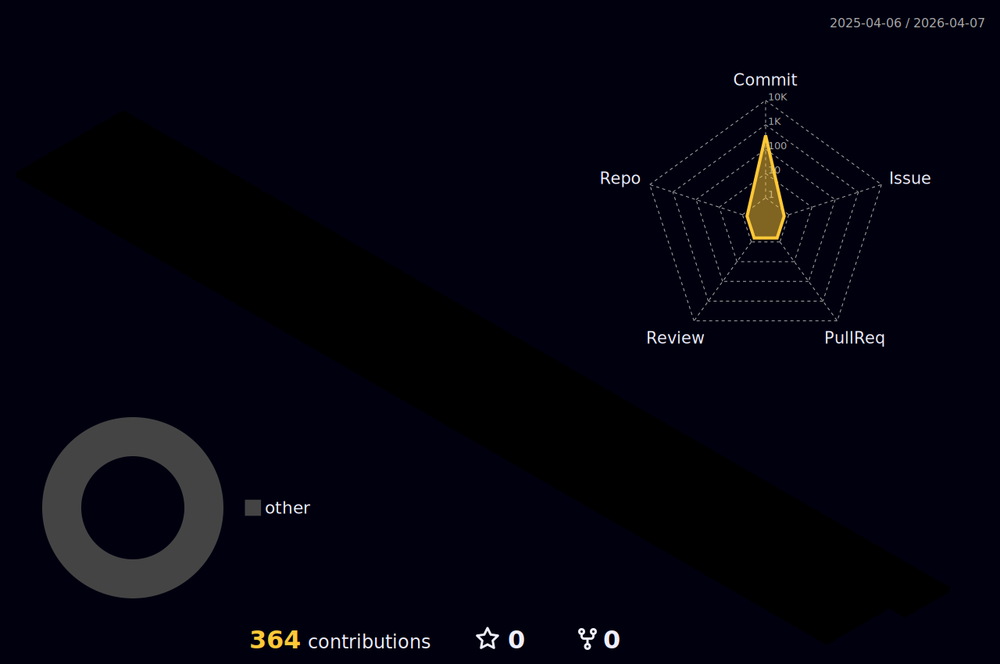

    

    <h2 style="border-bottom: 1px solid #d8dee4; color: #282d33;">🐯 개발자 yukhoe31입니다.</h2>

    

    

    <h2>💻 Projects</h2>
    

    <table >
        <tr>
            <th>기간</th>
            <th>내용</th>
            <th>설명</th>
        </tr>
        <tr>
            <td>2023.03 ~ 2023.08</td>
            <td><a href="https://github.com/yukhoe31/app_sandwich">써브웨이 샌드위치 맞춤형 추천 서비스</a></td>
            <td>졸업프로젝트:샌드위치 조합 추천 애플리케이션</td>
        </tr>
        <tr>
            <td>2024.04 ~ 2024.04</td>
            <td><a href="https://github.com/JunbroGit/SemiProject">KyotoInside</a></td>
            <td>쌍용교육센터 세미프로젝트:관광지 소개 웹사이트</td>
        </tr>
    </table>
    

    

    

    <h2 style="border-bottom: 1px solid #d8dee4; color: #282d33;">🛠️ Tech Stacks</h2>
    

    

        
        
        
         	
        
        
        
        
         
        
        
        
        
    

    

    

    

    <h2 style="border-bottom: 1px solid #d8dee4; color: #282d33; style="text-align: center;">🎄 Contributions</h2>
    

 

    

